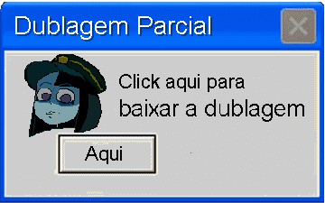

   

 

     
  <h1> Nonkey Jong Team   </h1>
  
🇧🇷 Fã-tradução do jogo: ENA: Dream BBQ 🎭 
  Jogo por: Joel Guerra
     
[![Discord](https://img.shields.io/discord/1355536478704373972?style=flat&logo=data:image/png;base64,iVBORw0KGgoAAAANSUhEUgAAAGQAAABSCAMAAACVH4HWAAAAIGNIUk0AAHomAACAhAAA+gAAAIDoAAB1MAAA6mAAADqYAAAXcJy6UTwAAADhUExURQAAAGJJTKCbknmUnnmdqn6irpqioMhOQNpNOtZLObNKP3KGjoKwwICyw4S5y4i7zI9nZeZMNvtMMPdNMvFONtNRQVxaXn6puDEwO/9KLelZRcNRRfRONX+Dg2Y/P55FP4K0xU5KTZsqH+xMNdZFMUk2N8s7KnedqkYkI2R7g10fG+1HMWVoaHgfF3ymtWuLl6TEyN3SufDkx9PbzMTMwOzewcG4pszBrNzPtuTYvejbv7qvn/Hhwsi8qNbLtLmyoYh/doS90f9KLf9LLIO/0v9JLPnpxvjoxvbpzPrqyf///3vBYpIAAABBdFJOUwAJIlB4mTRGh3IjLcLf7/0Quf713FwSsgP+ozTqGUgX+vz9zJv9/f39/v39/v7+/f7E/f397FyMs8vZQPRzof79Jr3EqQAAAAFiS0dESh4MtcYAAAAHdElNRQfqAhMHASKKU191AAAAAW9yTlQBz6J3mgAABntJREFUaN7tmWl74jYQx7G5zBVjYcAOsCSBbDdNt128y31kscz1/b9QJflAlsdYbF/0RTt5niSPQ/TzzH9mNLJzuf+KKWq+UCyl/72sVcpV5Z8AavlivfGg7+vNtI80DYRapqG1fw3UKRW6DX3PTM+nfMgqt1wbY5eAHiu95j3rkxssFeoPe4+YT0lzRTGwTQxTQ32j0pP2x6pRArOA4RFXLKU5UGulUj7/6VO516sOm4qV8x3BmH1zGadqyQiRL4ZRuppXLxS79UbjgdjT80ur3zfNkTHWDJf6YUdG/DHH5Ux3at2HPWAeiR3zy9s/vX7GB9dlKyI7YcSdx95txqC7zzDvty+fMX/3CXOxMbwJKegZiL339vv7LQQxhCo3g9XgFtSj7zoP+eMryoDYuH8jYEp2sDz9+SUbgh+bqZD8E+8DTCG62/bhkEFptdMYah2KleAJ0Z2schviYjyq3qs6d53qbmcbRpqE6hCA1b6E7kwVE9TeKgqL6hCM6E5WkHHl0YId0cHlY5L8ySSRMASlceBIhibeX6QUcYbuAQVwpdbwoHUFp1gpyoQLdiWroUSSyEIAV7jUAqWnvxJXSSkiKQLVPpFgviOQN7Fr0rozV4Ra6dRvrs3rLs0gZR9v+WHXyshh7+2rdLRorcQ6mFJMAQhJRpPrDgh+VGKye/tU4+Un9X6HxfeVQrg16fsUl3yjfV4uf6m5sTaZvVkF0aLJJQ8hroyizctK9l+44Mlm8n4XBLXKcLUDUQovsc51jyhcqchGCxwiXGrp+WU0o9yK7lcMk/5QJ5MjKyIv7FwxBOqPjFEfpWGi/LJoJYLlpzcKtY6iDPLdJ7qXsOTiNTmgUaU37Ax7lVEKJhrBrOI3XdcBjN6thV2n0AiTi3ejpfnjgpWrjlsplKAVDybO9+8/vlESQ0W0Yue6peUbCd3dVuVa0EoFpET9qzQ9npyzE5H2LDTkUDLgN87CE5nrqO4RBo25pmF1xqAroSgz5+TbOUZ6iB+vOt29/vqCrpoIo5VVNQEKmcD8Jjk/Xe18IiCf1BWOGfkntmMdQog4VVsa1Dtd/MiiuTjF7Ey/zufvM2GNYZ3ojq4zRGILL8OqGPRmB8sjXduJo05T8VytFH3dA09coyN8YDgCIWY10D1px5UqrJErvvEQLI4JlmKAojCP1xsIcloNREjhLWoqGIDkQAjpCVT5LR8o5wZkHm2L7LwrCfETZA4QqCZiuKzdx5cXX3gGMcRDLqyJTdPL2p1Ac4TsynUmZ0bxHw3YrimeQHp9uOaJy8pCTK7g152wxnp6PH+8vrwH0ruJw1QFnjFcsjs2l6DuJL3iOaxQjy8BhfZ7JJwLU6JlI3OYG6xgCHElFvQ8y/TLj+ev7/4BRXQlxRH7QOKqxiC89pstlz+lSeAgpfgbFzLLHKPdT9mYXVIoUC0GqOk2Kur1JPzb5cdreMZGo3J4G1bbTGFgCllHELGxnI6bXX5okVKubVfRtePlZ1QuqK+xh09Kb9xKHTAwmVhSCt5f8TSdzOfzxcq5fuZ4+YiGboyQaWja2OinzxK2HUGSGRxxHOcUu43jBzfZ04dcCN1CYJskCOyJc0q1y8cdxwcKQQLkxtoxyB0TXhJy05xfg2A+XE7KoqKdU8J18O8b1kSoEwdcnrtypyYsheGN8Qby8nHP4dSf7FUOkqW7E0DuOW4dDqTiByt4+XSgAx4cXTetXPpV0urhlRbbyeYERvL8k4ccQsRIg+dhurtZuzO00q6TG8x2K67ar66JnhBC32gPc0piUqXtmh3pShMHKMfVlgwSSmm7mCbiduaPQvQEFDykH1aSgyrZ3kZsQ1Dn0ziA/XQmMzqvEM5utYm3Lx+C2RmrZRr+64ZhGzqj4NY4GAWU2dJJRv/oLLdsYlHU9XY3ISSH84SEqNUfjcM3NFXwGOS6Zvu6vVJnIMxqHg5GTXU92853i8VkMimOx2Ot0i5Xm8GeVdVM8KQVuRHsbOvFBpD/OF0Lw5fCLFg83BfBYchFRlmc/wZQzC47qbcu1jhROK5tVqDXAup2lRjt1zIM4oqQVy4ytbSnz+o8wISwucxrncQ8RPTWbr1CUbdLLl2XqiQjN4yGbZd60cu4ucFsEWTacTOTI1BVyr72pHCMSlXiH5rr+ZK1LTnVfVM05GKXvtFqyt6XStuWfLCoVQ3awKTezV3vrDaTzKzQem35t4z/279ufwNQfcSFTMI2YAAAACV0RVh0ZGF0ZTpjcmVhdGUAMjAyNi0wMi0xOVQwNzowMDoyMyswMDowMF665KYAAAAldEVYdGRhdGU6bW9kaWZ5ADIwMjYtMDItMTlUMDc6MDA6MjMrMDA6MDAv51waAAAAKHRFWHRkYXRlOnRpbWVzdGFtcAAyMDI2LTAyLTE5VDA3OjAxOjM0KzAwOjAwnj0o6wAAAABJRU5ErkJggg==&label=Discord&color=7289da)](https://discord.gg/WDAzMdNwxn) 

 
 

 
 Este é um projeto de fã para fã, não é oficial e não temos qualquer relação com o Joel G. e sua equipe.  
  

## Passo 1: Escolha uma versão 
###### O jogo atualmente conta com 3 versões do 1° capítulo.
<a href="https://drive.google.com/file/d/1CmS7Bkh1EHPVwdQjCSxiBypCo7UNVzkJ/view?usp=drivesdk">
   
</a>
♦️ <b>Apenas legendado</b> — A legenda inclui tradução de todos os diálogos, textos, texturas e cutscenes do jogo, sendo focada apenas na tradução dos textos. 
<small>(Caso você queira <i>saborear</i> as vozes originais, do jeito que veio ao mundo)</small>
   
<a href="https://drive.google.com/file/d/1Qpg3r85feCVwPcJ8-nMGnVTgp-yb096c/view?usp=drivesdk">
   
</a>
🔷 <b>Dublado e legendado </b> — O jogo apresenta personagens que falam vários idiomas. Nesta versão, apenas os personagens que falam inglês estarão dublados para o português, mantendo todos os outros idiomas originais. Ou seja, um personagem que fala japonês continuará falando japonês.  
<small>(O jogo está totalmente dublado em português nas partes em inglês, preservando os personagens que falam outros idiomas. Extremamente recomendado caso seja sua primeira experiência e queira jogar dublado)</small>   

## Extra: para você que já jogou.
###### Não é recomendado caso seja sua primeira experiência com Ena Dream BBQ. 

<a href="https://drive.google.com/file/d/1QDzNfD4Qb6NqOT_irUOygAvWZcKpnW1Z/view?usp=drivesdk">
  
</a> 
        🔶 <b>Dublagem extra</b> — Todos os personagens estarão dublados, independentemente do idioma.  <small>(Para você que já fez tudo do jogo e quer dar algumas risadas com essa nova   experiência de Ǝna)</small>
   
        
## Passo 2: Como instalar a tradução?   
#### <i>( *Ficou confuso? Pera que tem vídeo [Aqui](https://youtu.be/LimBAxz5ouI)!* )</i>
1. Abra a pasta onde você baixou *ƎNA*. Isso pode variar dependendo da pasta do computador em que você o baixou.  
    * *Para fazer isto, você pode ir na sua Biblioteca da Steam, encontrar *ƎNA DREAM BBQ* e clicar com o botão direito do mouse no jogo > Gerenciar > Explorar arquivos locais.*  
2. *Agora, com o arquivo .zip da tradução que você escolheu, mova todos os arquivos para a pasta "ENA Dream BBQ" e confirme em "substituir para todos os arquivos".*  
    * *Após abrir o jogo (e se tudo for instalado corretamente), ele irá fechar e reabrir sozinho, mas só da primeira vez.*  

#### Dúvidas ou problemas?  
Está tendo problemas? Não tema! Entre em contato com a gente pelo nosso servidor do Discord na aba [#ajuda-e-sugestões](https://discord.gg/pxX6cnkHV7), lá nós poderemos lhe ajudar pessoalmente com o seu problema. 🤙  
## Problemas conhecidos e considerações
* #### Links diretos
Temos notado que a tradução está circulando por meio de uploads não oficiais. Pedimos que não façam isso, é fácil uma versão antiga se espalhar enquanto uma nova já está disponível. Por isso privamos as versões antigas. Se for postar em fóruns, grupos ou servidores, recomendamos que use o link oficial do nosso *Github* e/ou do nosso *servidor no Discord*. Não nos responsabilizamos por quaisquer danos à sua segurança, vindo de outras versões.  
* #### Linux
É do nosso conhecimento a (possivelmente temporária) falta de build nativa para Linux, todavia, é completamente possível rodar o mod do jogo usando o Proton da Steam (recomendamos a 9.0-4 ou superior) e colocando o comando ( **WINEDLLOVERRIDES="winhttp=n,b" %command%** ) nas **OPÇÕES DE INICIALIZAÇÃO** clicando com o botão direito no jogo e indo em: **Propriedades** > **Geral**. 
* #### Mac 
No momento não recebemos muitas demandas de build para MacOS, todavia, aceitamos sugestões e ajudas que viabilizem um possível port futuro.  
* #### Feedback
Caso você tenha identificado um erro, como um bug ou um texto mal traduzido, estaremos felizes em consertá-lo, por isso por favor nos contate na seção [#feedbacks-erros-sugestões](https://discord.gg/SBe3drzkAr).    
## Sobre a Dublagem!

    
   ㅤ
    

 

Gostou da dublagem? Foi inteiramente feita, dirigida e mixada pelas equipes de fã-dublagem [**Ghost Clematis**](https://www.youtube.com/@GhostClematisOFC) e [**Void Dublagens**](https://www.youtube.com/@voiddublagens). Nós só a colocamos no jogo e adaptamos as legendas, então todos os créditos e direitos são deles pelas versões dubladas.  

<b>Krisouls</b> ▸ Direção de dublagem e Adaptação de roteiro 
<b>Trix</b> ▸ Direção de dublagem, Edição e Mixagem 
<b>Mikaela</b> ▸ Adaptação de roteiro  

<b>Krisouls</b> ▸ ENA (Vendedora) 
<b>Mikaela</b> ▸ ENA (Malvada, Ressaca) 
<b>Gustavo Ribas</b> ▸ Froggy 〢 Homem Suspeito 〢 Frank Imperdoável 
<b>Odair Santos</b> ▸ Dratula 
<b>Artupente</b> ▸ Acumulador Alex 
<b>Giovanna Gregório</b> ▸ Recepcionista 
<b>Messy Moon</b> ▸ Shoryo 
<b>Tiago Holles</b> ▸ Counter Eye 〢 Taxista (SOCIO) 
<b>Oliveira</b> ▸ Taxista (DOOM)  
<b>Nycrow</b> ▸ Taxista (CREISE) 
<b>Big R</b> ▸ Túmulos 〢 Phindoll 
<b>Ana Beresil</b> ▸ Linda 
<b>Claire Goodend</b> ▸ Laurel 
<b>Davi Retfield</b> ▸ Laura 
<b>Opallis</b> ▸ Maude 
<b>Trix</b> ▸ Taski Maiden 〢 Dahlia 〢 Cão-Ampulheta 
<b>Mitsu Toshiyuki</b> ▸ Theodora 
<b>Joo Migs</b> ▸ Xamã, Bunrako-man 
<b>Brandeskitos</b> ▸ Kane 
<b>Dubs com a cha</b> ▸ Coral Glasses 〢 Mitu 
<b>Zk</b> ▸ O Bus 
<b>Baianores</b> ▸ Leiloeiro 

## Créditos Capítulo 1: Porta Solitária
<b>[Demetrius](https://x.com/iidkdeme)</b> ▸ Tradução 〢 Programação 〢 Revisão 
<b>[Zoti](https://x.com/zoti_n)</b> ▸ Tradução 〢 Programação 〢 Vídeos e Imagens 
<b>Iggy</b> ▸ Tradução 〢 Revisão 〢 Vídeos e Imagens 
<b>Pasokad</b> ▸ Tradução 〢 Imagens 
<b>Sam</b> ▸ Tradução 
<b>Solurio</b> ▸ Programação 
<b>ApoloDaisuke</b> ▸ Revisão 
<b>Dionysus</b> ▸ Tradução  

<b>Abigail_8bits</b> ▸ Ajuda em 3D 〢 "DORES" letras dançantes na mitu. 
<b>Bixin</b> ▸ Ajuda em 3D Letreiro 〢 "Atingir o ponto fraco do Chefe" e "Meta de trabalho"  
<b>Toast_buns</b> ▸ Suporte em Edição de Vídeo.  
 
 ###### <small>Um agradecimento a todos que nos apoiaram e mandaram mensagens positivas para todo o nosso time! Desejamos um bom trabalho a todos os CLTs e um feliz ƎNA DAY 2026!!!</small>
